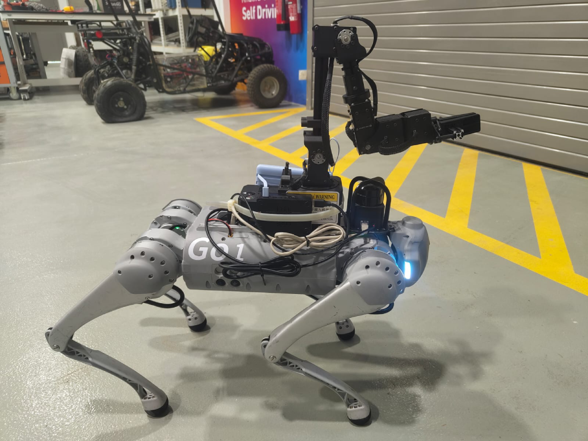

# Unitree Go1 Hardware Interface



Welcome to the **Unitree Go1 Hardware Interface** repository. This project provides a hardware interface for remote control and autonomous navigation of the Unitree Go1 robot via a web interface. It supports advanced functionalities including:

- **Remote Control & Autonomous Navigation:**  
  Forward ROS topics from the Go1’s bottom Nano through the Go1’s Raspberry Pi's to an external PC. This allows the PC to run a rosbridge server and a web-based control interface for commanding the robot and visualizing its status (e.g., via RViz).

- **K1 Arm Integration:**
  The repository includes integration for a K1 robotic arm, which is mounted on the Go1 for object manipulation tasks (such as autonomous delivery). The K1 arm is controlled using NXROBO’s [sagittarius_sdk](https://github.com/NXROBO/sagittarius_sdk) together with our custom code. You can either run a standalone C++ application on its dedicated Pi or use an optional ROS package that provides a ROS-based interface to the same functionality.

- **Hand Gesture Recognition:**  
  A separate hand gesture recognition project is also provided as a catkin workspace. This module can be used for gesture-based control or further research, while remaining independent from the main Go1 interface.

> **Note:** This repository is structured for seamless team collaboration, allowing developers to pick up and extend the work where it left off.

---

## Overview

1. **Autonomous Navigation:**  
   The Unitree Go1 is enabled for autonomous navigation through its hardware interface:

   - **Network Configuration:**  
     The Go1’s Raspberry Pi is configured to enable IP forwarding and NAT (using iptables) to share ROS topics from the bottom Nano with an external control PC.
   - **ROS Bridge & Web Interface:**  
     The control PC runs a rosbridge server that converts ROS topics to WebSocket messages, allowing remote control and visualization via a web interface.
   - **ROS2 Integration Testing:**  
     Alternative ROS2-based methods were evaluated to determine the most reliable setup. Detailed test results and the rationale behind the final approach can be found in [autonomous_navigation/ros2_integration.md](autonomous_navigation/ros2_integration.md).

2. **K1 Arm Integration:**  
   The K1 arm, used for object manipulation, is controlled using NXROBO’s [sagittarius_sdk](https://github.com/NXROBO/sagittarius_sdk) combined with our custom code. Two implementations are available:

   - **Standalone C++ Implementation:**  
     Run our custom C++ application (located in `k1_arm/sdk_control/`) on the dedicated Raspberry Pi attached to the K1 arm.
   - **ROS Package Implementation:**  
     Build and launch the ROS package in `k1_arm/ros_package/` to control the arm via ROS topics.

3. **Hand Gesture Recognition:**  
   The hand gesture recognition module, provided as a separate catkin workspace in the `hand_gesture/` folder, can be used for gesture-based control or research purposes.

> **Note:** For more details on setup, usage, and technical documentation, refer to the `README.md` file in each component's folder.

---

## Getting Started

- **Hardware Setup:**  
  Understand how the K1 arm and LiDAR are mounted and connected to the Go1, along with the Raspberry Pi setup for controlling the K1 arm. See [autonomous_navigation/system_setup.md](autonomous_navigation/system_setup.md).

- **Network Setup:**  
  Follow the steps in [autonomous_navigation/system_setup.md](autonomous_navigation/system_setup.md) to configure IP forwarding, NAT, and routing on the Go1’s Raspberry Pi and your control PC.

- **Launching the ROS Bridge:**  
  On your control PC, run:

  ```bash
  roslaunch rosbridge_server rosbridge_websocket.launch address:=0.0.0.0 port:=9090
  ```

  Then, use your web interface (e.g., AutoEye) to subscribe to topics such as `/cmd_vel` and `/map`.

- **K1 Arm Control:**  
  Choose your preferred method:

  - For the standalone C++ implementation, navigate to `k1_arm/sdk_control/` and follow its README.
  - For the ROS package implementation, build and launch the package in `k1_arm/ros_package/`.

- **Hand Gesture Recognition:**  
  See `hand_gesture/README.md` for instructions on running the gesture recognition system.

---

## Demo

Watch the demo video to see the system in action:  
[Demo Video](assets/demo_video.mp4)

---

## Additional Resources

Explore the following resources for more detailed guides, SDKs, and external documentation:

- **Go1 Operator Guide:** [Go1 Control and Navigation](https://kb.avlab.io/20-DevOps/20-Brain%20Map/Unitree-Go1-Edu/)
- **K1 Arm Operator Guide:** [K1 Arm Control and Integration](https://github.com/AV-Lab/avlab-kb/blob/syed_dev/docs/20-DevOps/20-Brain%20Map/K1-Robot-Arm.md)
- **K1 Arm SDK:** [NXROBO Sagittarius SDK](https://github.com/NXROBO/sagittarius_sdk)
