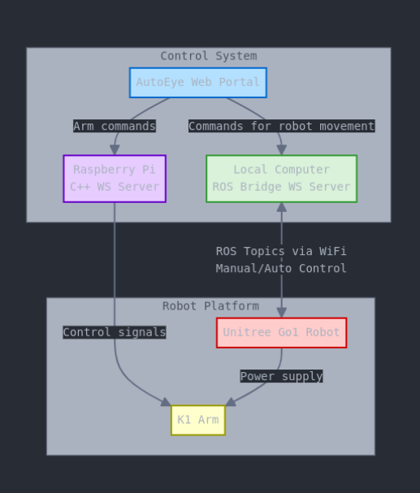

# System Setup

This document describes the **hardware configuration** of the Unitree Go1 and K1 arm, along with the **network setup** required to forward ROS topics and enable remote control through a local computer or web portal.

---

## Overview

Below is a high-level diagram showing how the robot platform, the dedicated Raspberry Pi, and the external control system interact:



- **AutoEye Web Portal** (or similar UI) sends high-level commands.
- **Local Computer** runs a ROS bridge (rosbridge_server) for manual/auto control.
- **Raspberry Pi (K1 Arm)** handles arm commands via a C++ WS server or ROS package.
- **Unitree Go1** receives robot movement commands and powers the K1 arm.
- **K1 Arm** executes manipulation tasks, powered partly by the Go1 and an external power bank.

---

## Hardware Setup

### LiDAR Sensor

- **Connection:**  
  The LiDAR sensor is connected to the Go1 via an Ethernet cable.
- **Mounting:**  
  Securely attached to the Go1 using double-sided tape.
- **Power:**  
  Draws power from an external power bank.
- **Visual Reference:**  
  

---

### K1 Arm Setup

- **Mounting:**  
  The K1 robotic arm is mounted onto the Go1 using screws and nuts on a dedicated mounting rod. This secure mounting ensures stability during operation.

- **Power & Control:**

  - The K1 arm’s motors draw power from the Go1’s internal power supply.
  - Its dedicated Raspberry Pi, which runs custom control code based on NXROBO’s [sagittarius_sdk](https://github.com/NXROBO/sagittarius_sdk), is powered by an external power bank.

- **Visual Reference:**  
  

### Cable Management

- **Routing:**  
  Keep all cables (Ethernet, power) secured and clear of moving parts.
- **Power Check:**  
  Ensure external power banks are adequately charged and can support the LiDAR and Pi during operation.

---

## Network Setup

This section explains how to **forward ROS topics** from the Go1’s internal network to your external control PC.

### 1. Enable IP Forwarding on the Go1’s Pi

1. **Temporary Enable:**
   ```bash
   sudo sysctl -w net.ipv4.ip_forward=1
   ```
2. **Permanent Enable:**  
   Edit `/etc/sysctl.conf`:
   ```bash
   net.ipv4.ip_forward = 1
   ```

### 2. Configure NAT (iptables)

Assume:

- **wlan1**: Pi’s wireless interface (e.g., IP 192.168.12.1)
- **eth0**: Pi’s Ethernet interface to the Go1 (e.g., IP 192.168.123.161)

```bash
sudo iptables -F
sudo iptables -t nat -F

sudo iptables -t nat -A POSTROUTING -o wlan1 -j MASQUERADE
sudo iptables -t nat -A POSTROUTING -o eth0 -j MASQUERADE
sudo iptables -A FORWARD -i wlan1 -o eth0 -j ACCEPT
sudo iptables -A FORWARD -i eth0 -o wlan1 -j ACCEPT
```

### 3. External PC Routing

If your PC is on multiple networks:

1. **Remove Conflicting Default Routes:**
   ```bash
   sudo ip route del default via <gateway1> dev <interface1>
   sudo ip route del default via <gateway2> dev <interface2>
   ```
2. **Add Primary Default Route:**
   ```bash
   sudo ip route add default via 192.168.0.1 dev wlp114s0f0 metric 100
   ```
3. **Add Specific Route for Go1 Network:**
   ```bash
   sudo ip route add 192.168.123.0/24 via 192.168.12.1 dev <interface> metric 50
   ```

### 4. Verification

After completing the hardware and network setup, verify that the external PC can communicate with the Go1 and access ROS topics.

1. **Ping the Go1 Nano**  
   Ensure that the external PC can reach the bottom Nano:

   ```bash
   ping 192.168.123.15
   ```

2. **Check ROS Topics**  
   Once the network is configured, verify that ROS topics are visible and accessible:

   ```bash
   rostopic list
   rostopic echo /cmd_vel
   ```

   If the topics are visible and `rostopic echo` works, the setup is correct.

3. **Ensure Hostname Resolution**  
   In some cases, you may see the topics but not be able to echo their data. To resolve this, add the bottom Nano’s hostname to `/etc/hosts`:
   ```bash
   sudo sh -c 'echo "192.168.123.15 nx" >> /etc/hosts'
   ```

Once these steps are completed, the external PC can successfully **echo ROS topics**, enabling remote control and visualization of the Go1 through AutoEye or any other ROS-based tool.

---

## Next Steps

- **Launch rosbridge_server** to expose ROS topics over WebSocket and integrate with your web portal or local control PC.
- **Refer to usage guides** for manual control, autonomous navigation, and advanced visualization.
